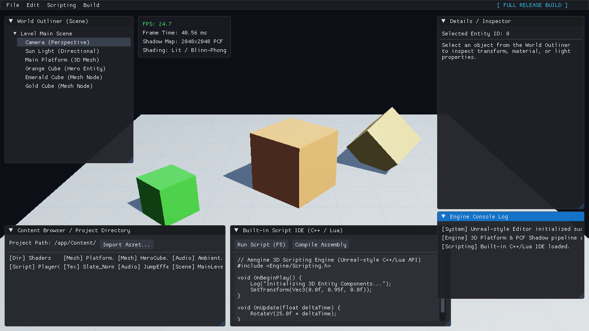

# Aengine-3D - C++ 3D Game Engine

A modern, lightweight 3D Game Engine written in C++17 using OpenGL, GLFW, GLEW, GLM, and Dear ImGui.



---

## Features

- **Modern 3D Graphics Pipeline**: Modern OpenGL (3.3 Core Profile) shader-based rendering with Blinn-Phong lighting and depth testing.
- **Dynamic Shadow Mapping**: Two-pass directional shadow mapping with 2048x2048 depth maps and Percentage-Closer Filtering (PCF) soft shadows.
- **Material Subsystem**: Material definitions supporting ambient, diffuse, specular, and shininess properties (Emerald, Gold, Bronze, Slate Platform, etc.).
- **3D Platform Scene**: Procedurally generated 3D platform with dynamic grid shading and interactive illuminated 3D objects casting soft shadows.
- **Camera Subsystem**: 3D perspective camera with view/projection matrix generation and keyboard/mouse movement controls.
- **Minimal User Interface**: Simple ImGui overlay displaying an FPS counter and nothing else.
- **Clean Architecture**: Modular C++ design separating Windowing, Camera, Shaders, ShadowMap, Geometry Meshes, Renderer, and UI.
- **One-Click Launch Scripts**: Convenient `run.sh` and `run.bat` scripts to build and run automatically.
- **Offscreen Verification Support**: Command-line support for offscreen headless rendering and frame screenshot capture.

---

## Directory Structure

```text
├── CMakeLists.txt        # CMake build configuration
├── README.md             # Documentation
├── run.sh                # Linux / macOS build and run script
├── run.bat               # Windows build and run script
├── shaders/              # GLSL shader files
│   ├── default.vert      # Vertex shader (positions, normals, shadow light-space matrix)
│   ├── default.frag      # Fragment shader (Blinn-Phong lighting, materials, PCF soft shadows)
│   ├── shadow.vert       # Shadow pass vertex shader
│   └── shadow.frag       # Shadow pass fragment shader
├── src/
│   ├── main.cpp          # Entry point
│   ├── core/             # Engine core systems (Window, Camera, Engine game loop)
│   ├── renderer/         # Graphics systems (Shader, Mesh, Material, ShadowMap, Renderer)
│   └── ui/               # User interface overlay (Dear ImGui)
└── vendor/               # Third-party dependencies (Dear ImGui)
```

---

## Prerequisites

On Ubuntu / Debian systems, install the required packages:

```bash
sudo apt-get update
sudo apt-get install -y build-essential cmake libglfw3-dev libglew-dev libglm-dev libstb-dev
```

---

## Quick Start (Run Scripts)

You can build and launch the engine with a single command:

### Linux / macOS

```bash
./run.sh
```

### Windows

```cmd
run.bat
```

---

## Manual Building & Running

If you prefer using CMake manually:

```bash
# Configure CMake
cmake -B build

# Build the executable
cmake --build build

# Run the engine
./build/Aengine3D
```

---

## Controls & Usage

- **W / A / S / D**: Move camera horizontally (forward, left, backward, right)
- **E / Q**: Move camera vertically (up / down)
- **Esc**: Exit the engine application

### Offscreen / Headless Mode & Screenshots

To run the engine in a headless environment (or capture an automated screenshot):

```bash
LIBGL_ALWAYS_SOFTWARE=1 xvfb-run -a ./run.sh --screenshot screenshot.png
```

---

## License

This project is open-source.
